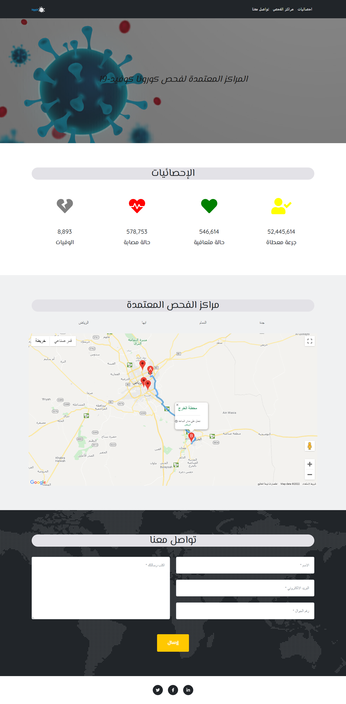

#  Map Project

## Introduction
Map Project is a website that identify coronavirus testing centers on google map and determined directions between users' location and selected center.

### Technologies Used:
* HTML
* CSS
* Vanilla Javascript
* Bootstrap
* Google Maps API

## Sceenshot:

## Live preview
Check out the demo page [Live Preview](https://halakh96-map.netlify.app/)
